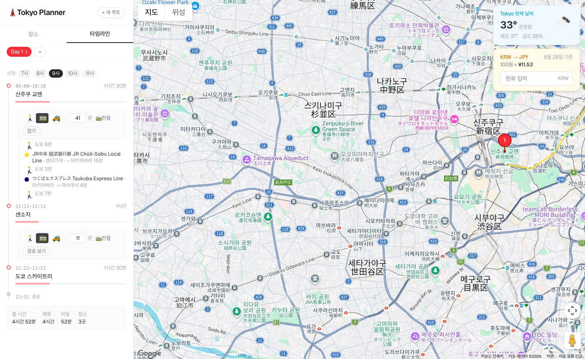
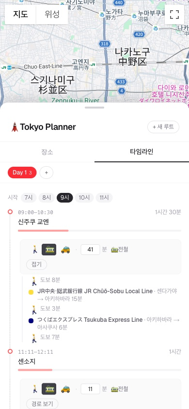
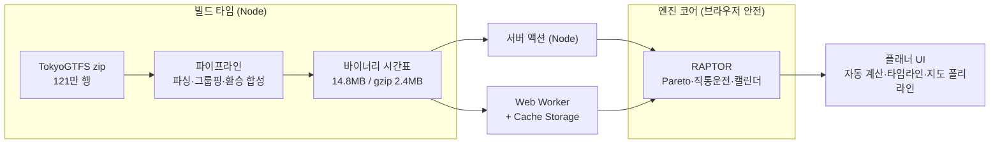

# 🗼 Tokyo Planner

**자체 경로탐색 엔진을 내장한 도쿄 여행 동선 플래너.**
지도에 장소를 찍으면 구간별 전철 경로가 자동으로 계산되고, 일차별 타임라인이 완성됩니다.
시간표를 브라우저에 캐싱해 **여행지에서 데이터 없이도(오프라인)** 경로를 계산합니다.

**Live demo → https://tokyo-planner-omega.vercel.app**

<p>
  
  
</p>

## 왜 직접 만들었나

일본 전철 경로를 API로 계산하려면 선택지가 없습니다 — **Google Directions/Routes API는
일본 대중교통(transit)을 지원하지 않고**(`available_travel_modes`에 TRANSIT이 없음),
NAVITIME·駅すぱあと 같은 상용 API는 유료에 쿼터 제한이 빡빡합니다.

그래서 오픈데이터로 경로탐색 엔진을 직접 만들었습니다:
[TokyoGTFS](https://github.com/MKuranowski/TokyoGTFS)(수도권 36개 철도 사업자, 121만 행)를
RAPTOR 알고리즘([Delling et al., 2012](https://www.microsoft.com/en-us/research/wp-content/uploads/2012/01/raptor_alenex.pdf))이
소비할 수 있는 바이너리 시간표로 컴파일하고, 같은 엔진 코드가 서버(Node)와 브라우저(Web Worker)
양쪽에서 돕니다.

## 특징

- **장소만 찍으면 끝** — 인접 구간의 이동수단·소요시간이 자동 계산됩니다
  (거리 기반: 근거리 도보, 이상 전철). 모드 칩을 누르면 그 수단으로 즉시 재계산.
- **일본 특화 경로 품질** — 직통운전(예: 도큐 도요코선 → 후쿠토신선)을 환승 0회로 정확히
  처리하고, 심야 시각(24시+)·평일/주말 시각표(여행 날짜 연동)를 반영합니다.
- **오프라인 PWA** — 시간표(gzip 2.4MB)를 최초 1회 받아 Cache Storage에 저장. 이후 경로
  계산은 Web Worker에서 로컬로 실행되어 지하철 안에서도 동작합니다. 홈 화면 설치 지원.
- **일차별 플랜** — Day 탭, 드래그 정렬, 장소 메모, 체류 시간, 저장/불러오기,
  새로고침에도 유지되는 자동 draft 저장.
- **모바일 대응** — 지도 전체 화면 + 플래너 바텀시트.

## 엔진 하이라이트

| 항목 | 수치 |
|---|---|
| 데이터 파이프라인 | GTFS 121만 행 → 바이너리 시간표, 빌드 1.5초 |
| 시간표 크기 | 14.8MB (gzip 2.4MB) — zero-copy 역직렬화 4ms |
| raptor route / trip | 2,403 / 91,707 (동일 정차 패턴 그룹핑) |
| 직통운전 매핑 | 27,024쌍 (transfer_type 4) 100% |
| 쿼리 속도 | 5~20ms (도쿄권, 멀티 소스/타겟 Pareto) |
| 정확도 검증 | 대표 40개 구간을 [Transitous](https://transitous.org)(MOTIS)와 대조 — 34개 ±5분 이내, 13개 ±0분, 자체 결함 0건 |
| 테스트 | vitest 62개 (TDD — RAPTOR 코어는 테스트 선작성) |

## 아키텍처



- `scripts/gtfs/` — 데이터 파이프라인 (CSV 파서, raptor route 그룹핑, 도보 환승 합성,
  직통운전 매핑, 바이너리 직렬화). 배포 빌드에서 데이터가 없으면 자동 다운로드·생성.
- `src/lib/engine/` — 브라우저 안전 엔진 코어 (RAPTOR, 서비스 캘린더, zero-copy 포맷,
  좌표→역 매핑). 서버와 Web Worker가 동일 코드 사용.
- 전철 계산은 **브라우저 우선, 서버 폴백**. 도보는 거리 근사(무료·오프라인), 택시만 Google.

## 로컬 실행

```bash
pnpm install
pnpm dev          # 첫 전철 계산 전 시간표 필요: pnpm data:build (zip은 자동 다운로드)
pnpm build        # 프로덕션 빌드 — 시간표 데이터 자동 준비 포함
pnpm test         # vitest
```

지도·날씨·환율 위젯은 API 키가 필요합니다 (`.env.example` 참고).
**전철 경로 계산은 API 키가 필요 없습니다.**

```bash
# 엔진 CLI로 바로 경로 검색해보기
pnpm tsx scripts/gtfs/query.ts 신주쿠 시부야 09:00
# 검증: Transitous와 40개 구간 자동 대조
pnpm tsx scripts/gtfs/validate.ts 09:00 20260901
```

## 데이터 & 라이선스 고지

- 시간표: [TokyoGTFS](https://github.com/MKuranowski/TokyoGTFS) (MIT) —
  [공공교통 오픈데이터 센터(ODPT)](https://www.odpt.org) 데이터 기반.
  본 앱은 경로탐색 "결과"만 제공하며 원 시간표 데이터를 재배포하지 않습니다.
- 역명 한국어 표기: GTFS translations (ko).
- 정확성·완전성은 보증되지 않습니다. 실제 운행 정보는 각 철도 사업자 공지를 확인하세요.

---

### English summary

**Tokyo Planner** is a Tokyo trip itinerary planner with a **built-in transit routing
engine**. Google's Directions API does not support transit in Japan, and commercial APIs
(NAVITIME/Ekispert) are paid with tight quotas — so this project compiles
[TokyoGTFS](https://github.com/MKuranowski/TokyoGTFS) (1.2M rows, 36 rail operators) into
a compact binary timetable (14.8MB / 2.4MB gzipped) and runs a
[RAPTOR](https://www.microsoft.com/en-us/research/wp-content/uploads/2012/01/raptor_alenex.pdf)
router over it — on the server *and* in a Web Worker, so routing works **fully offline**
(PWA). Handles Japan-specific quirks: through-service (in-seat transfers across operators,
zero-transfer), 24h+ overnight times, weekday/holiday calendars. Validated against
Transitous (MOTIS): 34/40 benchmark queries within ±5 min, 13 exact. Queries run in
5–20ms; 62 unit tests (TDD).
